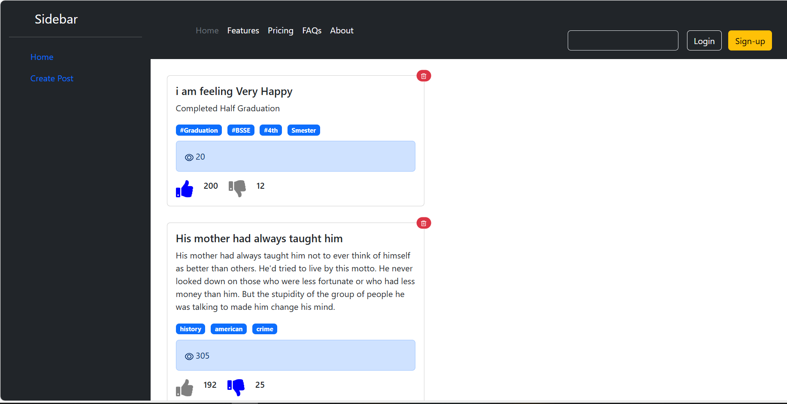
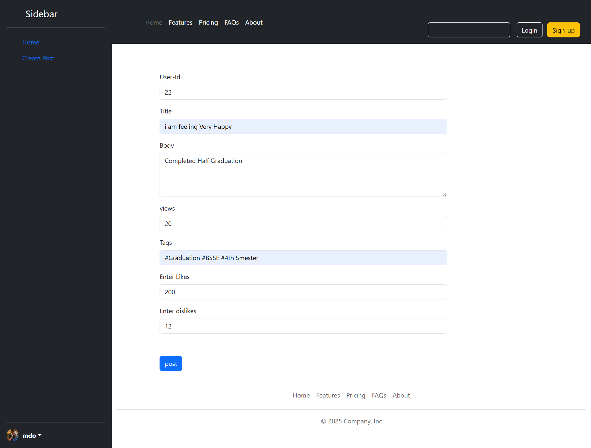

# 🚀 React Social Media App (REST API)

A **React Social Media Application** with **REST API integration**, global state management using **Context API + useReducer**, and interactive features like **Create Post**, **Delete Post**, and **Like/Dislike toggle**.

---

## 📂 Features

- 🏠 **Home Page**:
  - Fetches posts from a **REST API**.
  - Displays API posts and newly created posts dynamically.
- ✏️ **Create Post**:
  - Allows users to **create posts** (sends POST request to API).
- ❌ **Delete Post**:
  - Users can **delete posts** (sends DELETE request to API).
- 👍 **Like & Dislike**:
  - Users can **toggle Like/Dislike**.
  - Active Like button turns **blue**, active Dislike button turns **blue**.
- 🔄 **Global State Management**:
  - Implemented using **Context API** + `useReducer`.
- 🌐 **API Integration**:
  - Uses `axios` or `fetch` for API calls to a REST endpoint like [JSONPlaceholder](https://jsonplaceholder.typicode.com/).

---

## 🛠️ Tech Stack

- **React** (Functional Components)
- **React Router DOM**
- **Context API + useReducer**
- **Axios / Fetch API**
- **CSS Modules or Custom Styling**

---

## 📸 Screenshots

### ✅ Home Page



### ✅ Create Post Page



---

## 🚀 Getting Started

### 1️⃣ Clone the repository

```bash
git clone https://github.com/your-username/react-social-media-app-rest-api.git
cd react-social-media-app-rest-api

👨‍💻 Author

Dawood Tahir
📧 Email: dawoodta80@gmail.com
```
